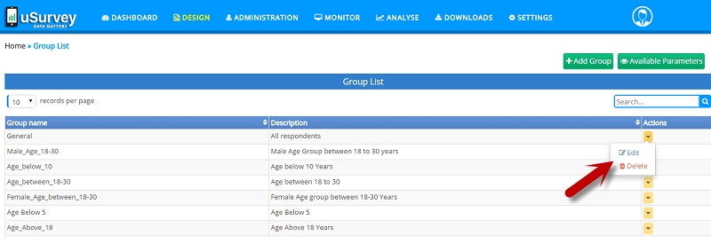

###Groups

Groups are Survey dependent classification of people/respondents based on their Age, Gender and combination of both into one or more survey- respondents categories called Groups.
Population has to be segment into Groups / multiple groups and our system allows us to create as many as needed.

From this above Groups page, Groups are managed, i.e. to Create a New Group, Edit existing Group, Delete Groups and Manage Parameters

###Create a New Group
Groups are available from main menu under, <b>Design</b> >> <b>Groups</b>

To create a new Group, click on ‘Add Group’ button at top right of the Groups page, that opens a form to create a new Group, which has following elements;

###Elements of Group

<b>Name</b>: Is Group Name, which is a unique identity to a Group and is a mandatory field.   

<b>Description</b>: A short description about Group

<b>Parameter</b>: Need to select a parameter, based on which Group is created. Like Age, Gender  

<b>Operator</b>: Also need to select an Operator based on the Parameter value, like value starts with, equals to and between, etc.

A Group is created by providing above all field, such that a Group can be created using a single or combination of Parameters, finally click on ‘Save’ button to Create Group. 

<b>Existing Criteria</b>
This table shows list of parameters used in creating a Group and can be altered by Deleting the existing one and assigning a different parameter to the same Group Name, by changing the ‘Parameter’ and ‘Operator’ values, then click ‘Save’ button.

<b>Edit and Delete Groups</b>
From the Groups Table each of the Group has Action items to ‘Edit’ and ‘Delete’ Group.

To Edit a Group – In the table under column name ‘Actions’ select ‘Edit’ to modify existing the criteria, name, description, then click ‘Save’ button.

To Delete a Group – In the table under column name ‘Actions’ select ‘Delete’ to remove from list, before deleting you will be prompted with conformation to delete, click ‘Yes’ to Delete permanently.

###Available Parameters

Parameters plays a major portion in creating a Group, to check what are the Parameters available, Add, Edit and Delete Parameters are managed.

<b>Add Parameters</b>

To Add Parameter, click on ‘Add Parameter’ button at top right of the Parameter page, that opens a form to create a new Parameter, which has following elements;

<b>Elements of Parameter</b>

<b>Variables Name</b>: Is an identifier for Parameter, Enter the name of the Parameter 

<b>Text</b>: A short description about Parameter

<b>Answer Type</b>: Select an Answer Type for Parameter from dropdown list, such that Parameter is of type Text, Numeric and Multi choice.

A Parameter is created by providing above all field, finally click on ‘Save’ button to Create Parameter or click on ‘Save and Add More’ button to continue adding more Parameters to the list.

<b>Edit and Delete Parameter</b>
From the Parameter Table each of the Parameter has Action items to ‘Edit’ and ‘Delete’ Parameter.

To Edit a Parameter – In the table under column name ‘Actions’ select ‘Edit’ to modify existing the Variable name, Text and Answer Type, then click ‘Save’ button.

To Delete a Parameter – In the table under column name ‘Actions’ select ‘Delete’ to remove from list, before deleting you will be prompted with conformation to delete, click ‘Yes’ to Delete permanently.

<b>View Options</b>: This Action item is visible only for the Questions that has Answer Type “Multi choice”, to view Answer Choices.

<b>Export Parameter</b>
Click on ‘Export Parameter’ to download available list of Parameter in ‘.CSV’ file format.
