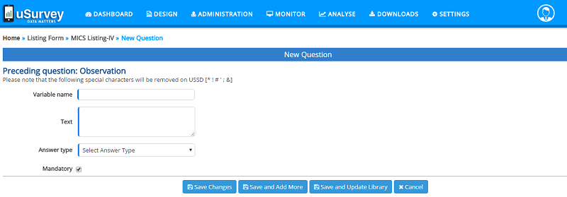
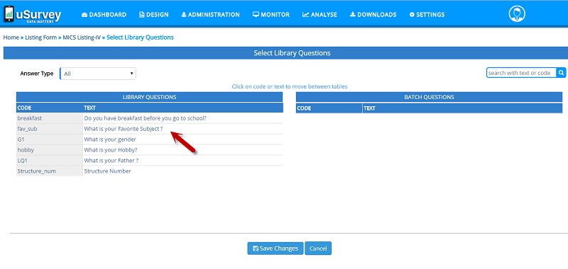
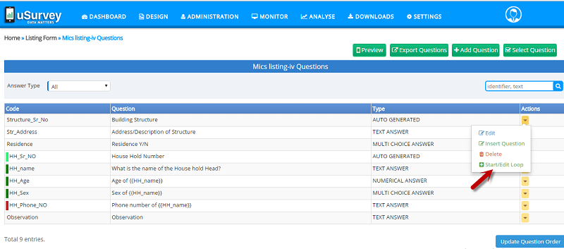
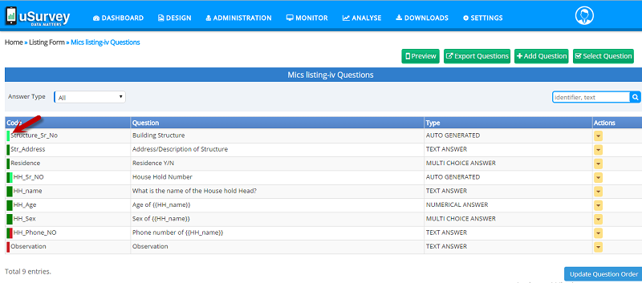

###Listing

The Listing is generally carried out by field staff other than interviewers, as a separate field operation conducted before the survey starts. This pre-process has the following benefits

1. It creates set of common questions to be asked before any survey is captured, as a one-time effort. For instance, the demographic details of household residents is required before conducting any household survey. Such data can be captured as part of the Listing.

2. By creating a separate Listing the system gives the user flexibility to use the same Listing for multiple surveys.

Listing is available from main menu under **Design** >> **Listing Form**

Listing is a set of Questions that can be customized/configured for any survey by reusing same Listing.

###Creating New Listing

To create a new Listing, click on the ‘Create New Listing Form’ button at top right of the Listing page, that opens a form to create a new Listing, which has following elements; 

**Elements of Listing form**:

* **Name**: Is Listing Name, which is a unique identity to a Listing and is a mandatory field.

* **Description**: write about the importance of the Listing in short.

* **Access channels**: This will identify on which channel this survey has to be conducted and has two channel ODK and USSD

A Listing Form is created by filling above all fields, finally clicking on ‘Save’ button to create Listing.

**Search**: One can find Listings in the application, using the search bar at top right side of this Listing Form page, by providing Name or description.
  
On the ‘Listing Form’ page one can view all the Listings created in the application, in a tabular form with following column names:

**Sts**: Represents Status of the Listing by color indicator, that means each of the Color code indicates as:

 •– Not Started 
 •– Ongoing 
 •– Completed 

**Name**: Is Name of the Listing, which is a unique identity to represent Listing and is a mandatory field.   

**Description**: A short description about Listing

**Total Respondents**: once the listing operation is completed, this column will be updated with the count of participants/ respondents.

**Action**: Each of the Listing has following Actions: ‘Edit’, ‘Delete’, ‘View/Edit Questions’, ‘View Data’ and ‘Clone’

**Actions in Listing Form**:

* **Edit**: click on, Action Item ‘Edit’, User can Edit only the name of the Listing, Description and selection of Access channels (OBK, USSD)

* **Delete**: click on, Action Item ‘Delete, the entire Listing is removed, before deleting you will be prompted with conformation to delete, click ‘Yes’ to Delete permanently. 
This option is not available for completed listing

* **View/Edit Questions**: click on, Action Item ‘View/Edit Questions’, navigates to ‘Listing Questions’ page to View or Edit Respective Questions in Listing

* **Clone**: click on, Action Item ‘Clone’, an another copy of same Listing Form is created along with Listing Questions, except existing Looping and Logic

* **View Data**: This Action Item is available only for the completed Listing operation in the field.  click on, Action Item ‘View Data’, to view data collected for this particular Listing

**Creating Questionnaire to the Listing Form**: 

On the ‘Listing Form’ page you can view all the Listings created in the application. 

To add new questions in Listing can be done in 2 ways

1. Click on the Listing Name
2. Click on Actions Drop down and select the item ‘View/Edit Questions’

One can also select the questions from ‘Questions Library’ to add into Listing, using ‘Select Questions’ 

**Add Questions in Listing Form**:

Click on, ‘Add Question’ button at top right of the particular Listing page, this will open a form where one can create a Question, which has following elements; 

**Elements in Listing Question form**:

**Variables Name**: This is an identifier for Question, type a code for Question

**Text**: Is the actual Question, Write a Question. While typing a question, auto suggestion feature is available, which will prompt with the ‘Variable Name’ of preceding questions, that helps to include “answered text of preceding question” in framing this question. 
i.e. just type, double curly brackets to automatically prompt with the ‘Variable Name’ from preceding questions, 
Ex: type {{ , system prompts with ‘Variable Name’ then select any one to insert Variable Name, 
Like: {{structure_address}}
 
**Answer Type**: Select an Answer Type from dropdown list, such that Question has to be answered in any one of these formats only, that is ‘Answer type’ should be: “Audio, Auto Generate, Date, Geo Point, Image, Multi choice, Multi Select, Numeric, Text and Video”

**Mandatory**: To mark the Question, that has to answered compulsory. 

A Question in Listing is created by filling above all fields, finally click on ‘Save’ button to Add Question in Listing or click on ‘Save and Add More’ button to continue adding another Question to the same Listing or click on ‘Save and Update Library’ to add same to the ‘Questions Library’.

**Select Question**: On click, ‘Select Question’ button, User navigates to ‘Select Library Questions’ page where one can Add the Library Questions into Listing. 

To Add Question from Library to Listing, just Click on “Code” or “Text” to move Question between (Library Questions << / >> Listing Questions) tables, then click on ‘Save’ button at bottom of this page, to finish adding Questions to Listing.

**Search**: One can find Questions in Library by two ways:
**Sort** questions using ‘Answer Type’ dropdown at top left side of this page. Or
**Search** using the search bar at top right side of this page, by providing text or code.

**Export Questions**: On click, ‘Export Questions’ button, user can download the Listing Questions in “.csv” file format.

**Update Question Order**: 
Questions in the table can be rearranged. 
To change the order of the Question in table, just select the Question then drag (move up or down) and drop at new position/order you want to in the table, then click on ‘Update Question Order’ button at bottom of the Questions table.

On the ‘Listing Questions’ page one can view all the Questions created in that particular Listing.

**Search**: One can find Questions in Listing by two ways: 
**Sort** questions using ‘Answer Type’ dropdown at top left side of this page. Or 
**Search** using the search bar at top right side of this page, by providing text or code.

**Actions for Listing Questions**:

**Edit Question**: click on, Action Item ‘Edit’, User can Edit respective Question, ‘Variable Name’, ‘Text’ (Question), ‘Answer Type’ and can change ‘Mandatory’ type.

**Insert Question**: click on, Action Item, ‘Insert Question’ using which User can insert a New Question below the respective Question and rest of the process is similar to ‘Add New Question’.

**Delete Question**: click on, Action Item ‘Delete’, the Question is removed from list, before deleting you will be prompted with conformation to delete, click ‘Yes’ to Delete permanently.

**Caution while deleting a Question**: when a user attempts to delete a question, if that particular question is assigned with Logic or Loop, then along with the question logic or entire loop is removed respectively. 

**View Options**: This Action item is visible only for the Questions that has Answer Type “Multi choice” and “Multi Select”, to view Answer Options.

**Start/Edit Loop**: 

‘Start/Edit Loop’ is an Action item available only for the Questions that has Answer Type “Auto Generated”. 

Looping means repeatedly asking set of questions based up the need and purpose of the base question.  

To define the Looping concept, first of all one has to understand about terms that are used in creating a Loop are as following:

**User Defined**: Need to choose what set of Question come into loop, starting from this particular question and has to end loop with any of the consecutive question in the Listing. 

**Repeat Logic**: To apply Looping for a question there should be some base criteria to start loop, that is chosen from ‘Repeat Logic’ as “User Defined”, “Fixed number of repeats” and “Response from previous question”

**Fixed number of repeats**: Is chosen, need to provide ‘Repeat count’ – any specific no of times loop to be repeated.

**Response from previous question**: Is chosen, only when a question that exists before this base question with Answer Type “Numerical Answer”. This logic is based up on numeric value provided in the previous question.

* **Loop Ends At**: When a loop starts that has to be closed, here the choice at which question the loop as to be closed is selected.  

* **Loop Prompt**: This is a message prompt shown on Mobile App during the time of capturing this details. This message will help the Interviewer to proceed further.

###How to create a Loop?

One should be very careful while creating a loop, first of all analyze how a loop has to be created, using ‘Repeat logic’ and where to ‘End Loop’, as defined above select accordingly from ‘Repeat logic’ and ‘Loop end at’ to define a loop.

click on, Action Item ‘Start/Edit Loop’ which will take to ‘Start Loop’ page, now create loop as follows:

* select “Logic Type” from dropdown ‘Repeat logic’,
* select “Question at which loop should end” from dropdown ‘Loop end at’ and
* in ‘Loop Prompt’ Text Box, write some message about, instructing the loop flow,
* then click on ‘Save’ button to create loop

Now you will be viewing a looping representation on ‘Listing Questions’ page in the ‘Code’ column of the ‘Questions’ table 

**Loop Representation**:

*  |  - icon represents Loop - START,

*  |  - icon represents Loop - END,

*  |  - icon represents Loop - CONTINUATION

**Remove Loop**:

This Action item available only for the Questions that has Answer Type “Auto Generated” and a Loop is created.
click on, Action Item ‘Remove Loop’ which will remove the existing looping logic.

**Add Logic**: 

‘Add Logic’ is an Action item for every question expect for the Questions that has Answer Type “Auto Generated”.

Add Logic option will convert a question to conditional one such that question will have choices to “Reconfirm”, “End Interview”, “Ask Sub-Question” and “Skip To” which is based up on value/Answer provided.

one has to define the Logic here for respective question by satisfying the condition by providing ‘Eligible Criteria’, ‘Attribute’ Value, and ‘Then’ as follows:

**Eligible Criteria**: This is a condition made based up on this Question value “Starts With”, “Equals”, “Contains” and “Ends With”.

**Attribute**: Provide the “Value” as per the above ‘Eligible Criteria’ selected

**Then**: Based up on the ‘Eligible Criteria’ and ‘Attribute’ Value chosen, the condition for Question is applied here with following options:
  
* ‘Reconfirm’ – Prompts with conformation Question to validate the Answer 

* ‘End Interview’ – Skips the intermediate Question and moves to end of the questioner.
 
* ‘Ask Sub-Question’ – Provides an option to Create a Sub-Question based upon the ‘Attribute’ value. 

To do this, select option “Ask Sub-Question” than you will find a button with name ‘Add Sub-Question’ beside this,  
click on it to create a Sub-Question, same like create question, once you click on ‘Save’ button, you will find this Sub-Question in the dropdown ‘Choose Question’ 
beside it, now select the “Sub-Question” and click on ‘Save’ button.
 
* ‘Skip To’ - Provides the option to jump to any particular/ consecutive question in the list, by skipping / avoiding the intermediate Question. 

**How to Apply Logic to a Question?**

Click on, Action Item, ‘Add Logic’ this will open a form where one can create a Logic for Question, by providing ‘Eligible Criteria’, ‘Attribute’ Value, and ‘Then’ as per the condition required, then click on ‘Save’ button to create Logic.  

In the same page, logic that is created can be seen in table “Existing Logic”.
Which shows the created logic for this particular question and has option to ‘Delete’ the applied Logic

**Edit Logic**: 
In the ‘Listing Form Questions Template’ page, Questions that has Logic are represented with hyperlink, click on the respective Question, that shows options to ‘View logic’, ‘Edit’ and ‘Delete’

* **View Logic**: click to view the Logic that is Applied for this particular question

* **Edit Logic**: click to Edit the existing Logic that is Applied for this particular question

* **Delete Logic**: click to Remove the Logic that is Applied for this particular question