###Introduction

uSurvey portal is intended to design and define the Listings, Surveys and monitor statistical reports. On other end in the field, data collection and submission is done using hand-held mobile devices in two ways.

1. Offline Data Collection - Using Smart Phone
2. Online Data Collection  - Using Featured Phone

Hence to collect real time data, both offline and online methods are implemented.   
   In the locations, where there is a mobile phone network connectivity is available, data is transmitted to server instantly via USSD channel, using Featured Phone.   
   Whereas, in isolated mobile phone network connectivity locations, data collection is done offline via uSurvey App, using Smart Phones. This collected data is stored temporally in the hand-held device and transmits to server later time, once reaches to a location with internet connectivity.
 
Ultimately uSurvey application make paperless work and carry out Survey in a digitalized process with increased ease and accuracy of data. Which results in the release of Survey reports timely.

###Offline Data Collection
------
#####About uSurvey App

**Data collection and submission using Android Smart Phone**

uSurvey App is exclusively designed for survey data collection and submission using the hand-held mobile devices (Android Smart Phone/ Tablet). Thus using rich text forms, also supports media files, captures GPS location, stores data locally and works offline.

**Implementing uSurvey App**

Conducting Survey using uSurvey App is simple.

Enrolled Interviewers, has to do data collection and submission using Android App, uSurvey App is available on Google play store.

**uSurvey App Installation**

 Interviewers has to download uSurvey App form Google play store, as follows 

* On Android device, go to Google play store
* Search for “uSurvey” and choose uSurvey App from search results
* Select ‘uSurvey App’ in the result and click the Install button
* Click OK after viewing the security settings
* Once App installation is done, now uSurvey App is available in application list and ready to launch, as shown below in Mobile Screen-1
* Now launch uSurvey App on mobile

   
   Mobile Screen-1

App Home/landing screen has following options, as shown below in Mobile Screen-2

   
   Mobile Screen-2

**Configure uSurvey App**

For first time use and when app reset is done, one has to provide, App user credentials as a part of one-time configuration settings as follows:  

* To configure, press the Menu button on the phone while the app is opened, then Select ‘General Settings’, takes you to a new screen to change setting  
  as shown below in Mobile Screen-3

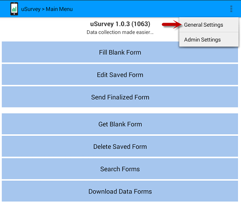   
   Mobile Screen-3

* Now under ‘Server Settings’ select ‘Configure platform settings’, as shown below in Mobile Screen-4  

   
   Mobile Screen-4

* In ‘Configure platform settings’ under ‘ODK Aggregate Settings’, make sure that, URL should be http://usurvey.unicefuganda.org/odk/collect/forms  

   
   Mobile Screen-5

* Username: enter ‘ODK ID’ of the Interviewer
* Password: enter ‘ODK Token’ of the Interviewer   (For above details, you need an interviewer defined on uSurvey portal and defined with an ODK ID)

   
   Mobile Screen-6

* Now come back to App Home screen using Mobile back key

**Using uSurvey App**

Follow these simple steps for survey Data collection: 
Get Blank Form, Fill Blank Form, Edit Save Form, Send Finalized Form, Download Data Forms, Search Forms and Edit Download Form

######Step -1: Get Blank Form

Once App is opened, in the Home screen hit on ‘Get Blank Form’ to download blank form, then you will be prompted “Please enter User name and Password for server”, then Interviewer has to conform his/her User name and Password, to proceed by clicking on ‘OK’. As shown in below Mobile Screen-7

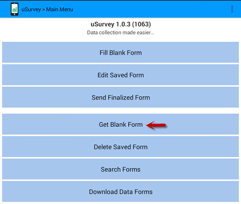   
   Mobile Screen-7

   
   Mobile Screen-8

Now you will be navigated to this below Mobile Screen-9, Select ‘Blank Form’ from list, usually blank forms, show with ‘Survey –Listing’ names and hit on ‘Get Selected’ As shown in below Mobile Screen-, then Hit ‘OK’

   
   Mobile Screen-9

   
   Mobile Screen-10

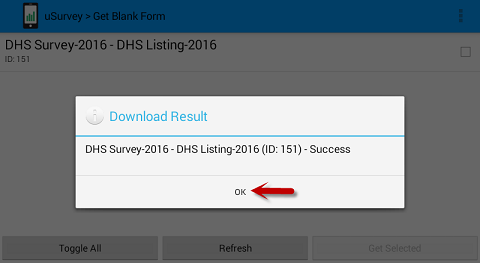   
   Mobile Screen-11

######Step -2: Fill Blank Form

In the Home Screen hit on ‘Fill Blank Form’ to fill questionnaire as part of data collection. Now select any of one the forms listed here. As shown in below Mobile Screen-

Now opens the actual questionnaire, to proceed filling the form - Just swipe forward and backward, then finally you will see ‘Save Survey and Exit’ hit to save.

As part of questionnaire, the very first question is “Select Enumeration Area” where you have to select any one of the Enumeration Area, which is mandatory and proceed to answer next question. 
Be very careful while selecting the Enumeration Area, once from is submitted there is no change to edit Enumeration Area.

Once filling the questionnaire is completed, you will be prompt with message “You are at the end of the ---- form” and select ‘Mark form as Finalized’ then hit on ‘Save Survey and Exit’.

######Step -3: Edit Saved form

This feature provides, option to view or edit completed questionnaire, including Enumeration Area before submission.

In the Home Screen hit on ‘Edit Saved form’ to edit filled questionnaire. As shown in below Mobile Screen-

You can select any form from list to view or edit, usually filled forms, show with ‘Survey –Listing’ names, tap on the listed items to proceed view or edit filled questionnaire, once changes are done, don’t forget to hit on ‘Save Survey and Exit’. At any instance of the from, one can exit the current form from undo by hitting on Mobile back key, which prompt with message to ‘Save Changes’, ‘Ignore Changes’ and ‘Cancel’ to the Form.

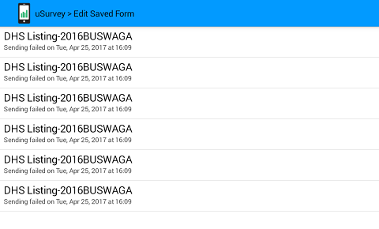

######Step -4: Send Finalized Form

The process of transmitting the completed forms to server, when there is an internet connectivity.

Now in the Home Screen hit on ‘Send Finalized Form’ to submit the completed questionnaire forms, As shown in below Mobile Screen-

Now you will be navigated to this below shown, Mobile Screen-, Select forms individually or hit on ‘Toggle All’ to select all forms in the list, then hit on ‘Send Selected’. As shown in below Mobile Screen-, if again you will be prompted “Please enter User name and Password for server”, then conform your credentials once again by clicking on ‘OK’. You will get success message if from is submitted or respective error message is shown.

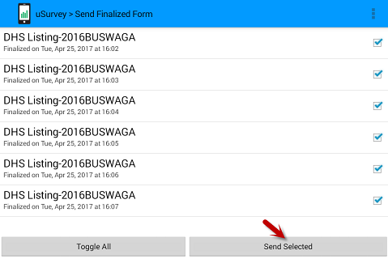

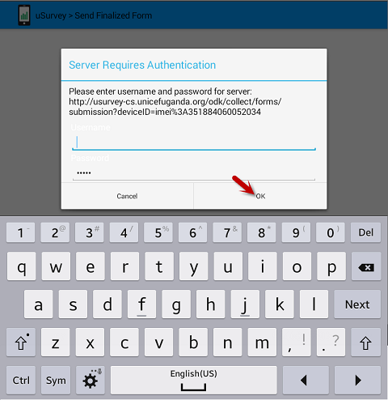

######Step -5: Download Data Forms

The feature to download completed Listing and Survey forms from server to make any changes.

In the Home Screen hit on ‘Download Data Form’ to get list of recent/current submitted forms. Now screen opens with the complete list of submitted forms, select forms individually or hit on ‘Toggle All’ to select all forms in the list, then hit on ‘Get Selected’. As shown in below Mobile Screen-, 

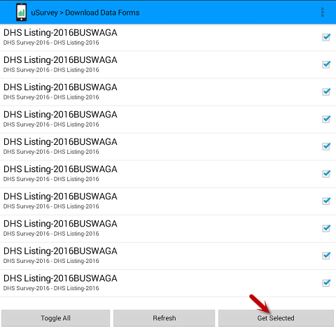

Then download starts, which takes several minutes, depends up on your Internet speed. As shown below Mobile Screen-

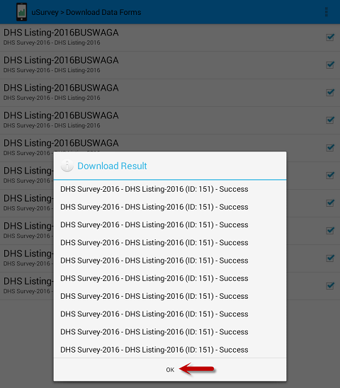

Note: Once Forms are downloaded then these forms are available from ‘Edit Saved Form’ and ‘Search Forms’ 

######Step -6: Search Forms

The feature to find completed Listing and Survey forms, to view or edit filled questionnaire.

In the Home Screen hit on ‘Search Forms’ to start searching for forms, which opens a search screen, where an Interviewer can search a beneficiary using data in the filled questionnaire and Hit on Search Icon in Key Pad, as shown in below Mobile Screen-

If the search criteria match the input data, then screen will show up with list of forms that matches entered key word, Interviewer has to Identify and select the exact beneficiary to view or edit the details.

**Edit Download Form**

This feature provides, option to view or edit download questionnaire forms and resubmit.

In the Home Screen hit on ‘Edit Saved form’ to edit filled questionnaire. As shown in below Mobile Screen-

You can select any form from list to view or edit, usually these forms, show with ‘Survey –Listing’ names, tap on the listed items or hit on ‘Go To Start’ to proceed view or edit filled questionnaire, once changes are done, don’t forget to hit on ‘Save Survey and Exit’. If any changes are done,
 don’t forget to repeat the steps in Send Finalized Form

 

 

 

 

There is an option to Exit Form by pressing the default ‘BACK’ button of the Mobile at any time while filling or using this App, which prompt with message to ‘Save Changes’, ‘Ignore Changes’ and ‘Cancel’ to the Form. As shown in below Mobile Screen-

 

**Delete Saved Form**

This feature allows user to remove the Forms from local device, to clear the local data.

In the Home Screen hit on ‘Delete Saved form’ to remove Forms.
As shown in below Mobile Screen-

 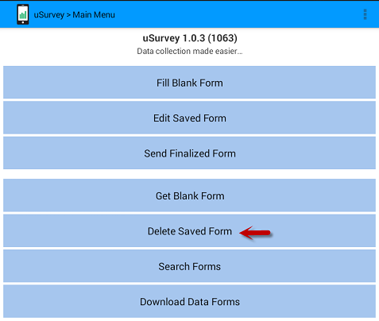

This screen is divided into two tabs,  
**Saved Forms**: Shows list of all completed forms.  
**Blank Forms**: Shows list of all blank forms.  

 

To delete, select forms individually or hit on ‘Toggle All’ to select all forms in the list, then hit on ‘Delete Selected Survey Forms’

 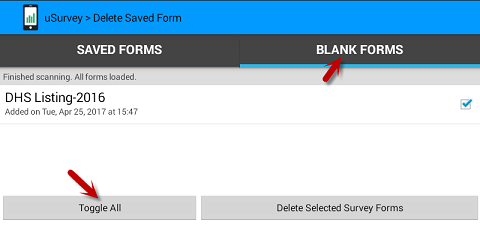

 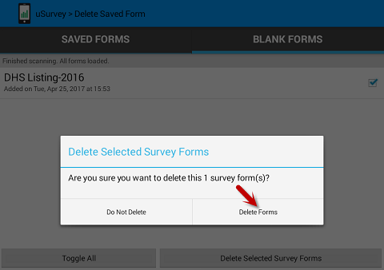

###Online Data Collection
------
#####USSD Integration
uSurvey fully supports survey participation on USSD using the interactive menu capability of the USSD platform. To begin, from uSurvey portal, interviewers are sent SMS with details of the code to dial in order to commence data collection (e.g. *256#). The interviewer dials the code and then the survey starts.
  

#####What do I need to conduct survey on USSD?

1. Any mobile phone would do.
2. You need a USSD Aggregator.
3. You need to choose a mobile network which supports your chosen USSD Aggregator.
4. You need your chosen USSD Aggregator to forward USSD messages to uSurvey as follows:
    * Requests can be sent as a HTTP GET or a POST to uSurvey USSD end point.
    * If you have hosted uSurvey with host IP `HOST_IP` and port `APP_PORT`, the USSD end point is `HTTP(s)://HOST_IP:APP_PORT/ussd`.
    * At a minimum, following parameters need to be sent to uSurvey USSD API from the aggregator:
        * `msisdn:` This parameter holds the mobile number of the responding interviewer.
        * `ussdRequestString:` This parameter holds the input string sent by the interviewer.
        * `transactionId:` This parameter holds the session ID of the USSD Interaction.
5. You need to maintain connectivity to your mobile network (Since USSD participation requires an active USSD session).  
6. Now assign the interviewer to the relevant Survey and Enumeration area (for more info on this see the relevant section in the [User manual](./user_manual.md#interviewer-page "Interviewer Page"))
      